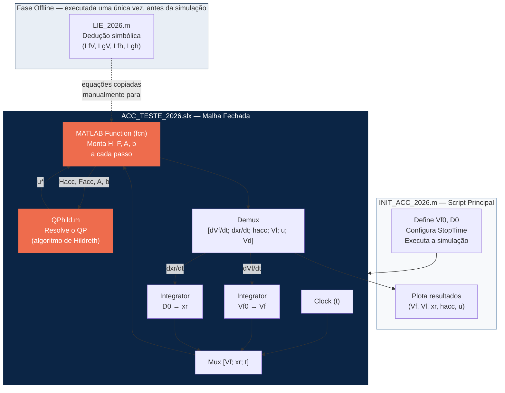
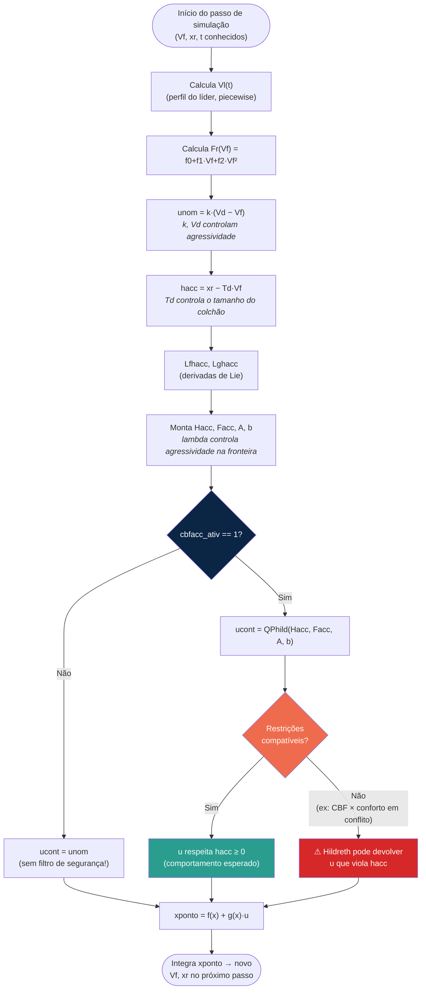

# Arquitetura da Simulação: Arquivos, Parâmetros e Sintonia

Este documento descreve como os arquivos do projeto se relacionam durante a simulação do ACC (CLF-CBF-QP), lista todos os parâmetros de projeto disponíveis e explica como o ajuste de cada um afeta o comportamento e a performance do sistema.

## 1. Visão Geral da Arquitetura

A simulação é dividida em cinco arquivos, cada um responsável por uma etapa do pipeline: dedução simbólica → montagem do problema de otimização a cada instante → solução do QP → malha fechada no Simulink → inicialização e pós-processamento.

### Responsabilidade de cada arquivo

| Arquivo | Papel | Roda quando? |
|---|---|---|
| `LIE_2026.m` | Deriva simbolicamente as Derivadas de Lie do modelo (`LfV`, `LgV`, `Lfh`, `Lgh`) usando o Symbolic Math Toolbox. As expressões resultantes são copiadas manualmente para dentro do bloco `fcn`. | Uma vez, offline, antes de codar o `fcn` |
| `ACC_TESTE_2026.slx` | Contém a malha fechada: Integrators (que guardam `Vf` e `xr` como estado), Clock, e o bloco MATLAB Function que chama o solver a cada passo. | Durante toda a simulação |
| `fcn` (dentro do `.slx`) | Recebe `[Vf; xr; t]`, calcula o perfil do líder `Vl(t)`, monta as matrizes do QP (`Hacc`, `Facc`, `A`, `b`) e chama `QPhild`. Devolve as derivadas de estado e sinais para plot. | A cada passo de integração do solver |
| `QPhild.m` | Resolve analiticamente o problema de Programação Quadrática via algoritmo de Hildreth, sem depender do `quadprog` nativo. | Chamada de dentro do `fcn`, a cada passo |
| `INIT_ACC_2026.m` (ou comandos manuais no workspace) | Define as condições iniciais (`Vf0`, `D0`), aciona a simulação e gera os gráficos. | Antes e depois da simulação |

> **Nota importante sobre o `fcn` atual:** o arquivo contém **duas formulações** de controlador, uma comentada e outra ativa:
> - **Comentada:** CLF-CBF-QP completo (CLF suave + CBF rígida, como nos slides).
> - **Ativa (`cbfacc_ativ = 1`):** um controlador proporcional nominal (`unom = k·(Vd − Vf)`) **filtrado** por uma CBF — essa é a arquitetura de *Active Set Invariance Filter (ASIF)*, também descrita em Ames et al. (2017) e nos slides que geramos. É essa versão que produziu os resultados que analisamos (incluindo a violação `min(hacc) = −4.2852`).

## 2. Dicionário de Parâmetros

### 2.1 Parâmetros do controlador (upper-level) — ativos no `fcn`

| Símbolo | Variável no código | Valor atual | Onde aparece | O que controla |
|---|---|---|---|---|
| $V_d$ | `Vd` | 22 m/s | `unom = k*(Vd-Vf)` | Velocidade de cruzeiro desejada |
| $k$ | `k` | 0.5 | `unom = k*(Vd-Vf)` | Ganho do controlador proporcional nominal |
| $\lambda$ (≡ $\gamma$) | `lambda` | 1 | `b = Lfhacc + lambda*hacc` | Agressividade da CBF perto da fronteira do conjunto seguro |
| $T_d$ | `Td` | 1.8 s | `hacc = xr - Td*Vf` | Time headway — tamanho do "colchão" de segurança |
| — | `cbfacc_ativ` | 1 | `if cbfacc_ativ == 1 ... else ucont = unom` | Liga/desliga o filtro de segurança (1 = CBF ativa, 0 = só nominal) |
| — | `Hacc`, `Facc` | `[2]`, `[-2*unom]` | Custo do QP | Faz o QP buscar o `u` mais próximo possível de `unom` (min-norm filter) |

### 2.2 Parâmetros do controlador — CLF-CBF-QP completo (comentado, disponível para reativar)

| Símbolo | Variável no código | Valor sugerido | O que controla |
|---|---|---|---|
| $c$ | `c` | 10 | Taxa de convergência exponencial da CLF (quão rápido `Vf` persegue `Vd`) |
| $p_{sc}$ | `psc` | 100 | Peso da penalidade sobre a variável de folga $\delta$ — quão "cara" é a relaxação da CLF |

### 2.3 Parâmetros físicos do veículo (hardcoded no `fcn`)

| Símbolo | Variável | Valor | Descrição |
|---|---|---|---|
| $m$ | `m` | 1650 kg | Massa do veículo hospedeiro |
| $f_0, f_1, f_2$ | `f0, f1, f2` | 0.1, 5, 0.25 | Coeficientes empíricos do arrasto aerodinâmico $F_r = f_0 + f_1V_f + f_2V_f^2$ |

### 2.4 Condições iniciais e configuração de simulação

| Símbolo | Variável | Onde é definida | Observação |
|---|---|---|---|
| $V_{f0}$ | `Vf0` | Workspace, antes de rodar o `.slx` | Condição inicial do Integrator de `Vf` |
| $D_0$ | `D0` | Workspace, antes de rodar o `.slx` | Condição inicial do Integrator de `xr` |
| — | `StopTime` | Model Settings → Solver | Precisa ser ≥ 70 s para observar todo o perfil de `Vl(t)` definido no `fcn` |

### 2.5 Restrição de conforto (atualmente **comentada** no código ativo)

| Símbolo | Variável | Valor sugerido | Observação |
|---|---|---|---|
| $a_{max}$ | linhas `A=[...;1;-1]`, `b=[...;2.0;2.0]` | ±2.0 m/s² | **Foi a fonte do conflito identificado** (`min(hacc) = −4.2852`) quando ativada junto com a CBF sem uma barreira unificada $h_F$ |

## 3. Fluxo de Decisão a Cada Instante de Tempo

Este segundo fluxograma mostra **onde cada parâmetro entra** na lógica executada dentro do `fcn` a cada passo de simulação — útil para saber exatamente o que mexer quando quiser mudar um comportamento específico.

## 4. Como Cada Parâmetro Afeta a Performance

### `Vd` — Velocidade de cruzeiro desejada
- **↑ Aumentar:** o erro `(Vd − Vf)` cresce sempre que o líder for mais lento, aumentando `unom` e a frequência/intensidade das intervenções da CBF.
- **↓ Diminuir:** menos conflito entre desempenho e segurança, mas o veículo "sub-utiliza" trechos de pista livre.

### `k` — Ganho proporcional do controlador nominal
- **↑ Aumentar:** resposta mais rápida ao erro de velocidade, porém `unom` cresce em magnitude — mais vezes o QP precisará "cortar" a ação nominal para respeitar a CBF, e mais perto se fica dos limites de conforto.
- **↓ Diminuir:** resposta mais suave e lenta, com menor probabilidade de saturar as restrições, mas convergência mais lenta a `Vd`.

### `lambda` (γ) — Agressividade da CBF na fronteira
- **↑ Aumentar:** o sistema tolera se aproximar mais da fronteira `h(x)=0` antes de reagir com força total — mais "aproveitamento" da distância disponível, porém **menor margem de segurança numérica**. Foi um fator que amplificou o conflito observado com a restrição de conforto.
- **↓ Diminuir:** reação mais cedo e mais suave conforme `h(x)` se aproxima de zero — mais conservador, distâncias de seguimento maiores que o estritamente necessário.

### `Td` — Time headway
- **↑ Aumentar:** define um conjunto seguro maior (`h = xr − Td·Vf` fica mais negativo para o mesmo `xr, Vf`) — o sistema breca mais cedo e mantém mais distância. Mais seguro, porém mais conservador em termos de fluxo de tráfego.
- **↓ Diminuir:** segue mais próximo, mas qualquer manobra do líder exige desacelerações mais fortes para preservar `h(x) ≥ 0` — aumenta a chance de esbarrar no limite de conforto.

### Restrição de conforto (`±2.0 m/s²`, atualmente comentada)
- **Achado do projeto:** ativá-la simultaneamente com a CBF de segurança, **sem unificá-las em uma única barreira** ($h_F$, ver Ames et al. 2017, Seção V-A-3), pode tornar as duas restrições simultaneamente inviáveis em cenários de fechamento rápido — foi exatamente isso que causou `min(hacc) = −4.2852`.
- **↑ Alargar o limite** (ex: ±4 m/s²): reduz a chance de conflito, mas piora o conforto percebido.
- **Correção recomendada:** substituir as duas restrições separadas por uma CBF baseada em força ($h_F$), que já nasce compatível com os limites de frenagem — ver seção "Próximos Passos" nos slides do TG.

### `c` e `psc` — (versão CLF-CBF-QP completa, atualmente comentada)
- **`c` ↑:** convergência mais rápida ao `Vd`, mas exige esforço de controle maior em regime transitório — mais provável de tensionar a CBF.
- **`psc` ↑:** o otimizador resiste mais a relaxar a CLF (`δ` fica pequeno) — desempenho de velocidade é defendido com mais afinco, e só cede quando a segurança está muito próxima de ser violada.
- **`psc` ↓:** o sistema abre mão da velocidade de cruzeiro com mais facilidade diante de qualquer sinal de risco — mais conservador, porém menos "decidido" em perseguir `Vd`.

### `Vf0`, `D0` — Condições iniciais
- Não são parâmetros de sintonia do controlador, mas **definem o ponto de partida em relação à fronteira do conjunto seguro**. Se `D0` for pequeno demais em relação a `Vf0` e `Td` (ex: `D0 < Td·Vf0`), a simulação já começa fora — ou muito perto da borda — do conjunto seguro, forçando frenagem imediata e intensa nos primeiros instantes.

## 5. Tabela-Resumo: "O que mexer para..."

| Quero que o sistema... | Parâmetro a ajustar | Direção |
|---|---|---|
| Converja mais rápido para `Vd` | `k` (ativo) ou `c` (CLF completa) | Aumentar |
| Siga mais próximo do líder (menor distância) | `Td` | Diminuir (com cautela) |
| Seja mais conservador na aproximação da fronteira segura | `lambda` (γ) | Diminuir |
| Priorize conforto mesmo com risco de infactibilidade | Limite de aceleração (`±2.0`) | Manter apertado |
| Elimine o conflito CBF × conforto (correção estrutural) | Implementar `hF` (barreira unificada) | — |
| Teste apenas o comportamento nominal, sem segurança | `cbfacc_ativ` | Definir `0` |

## 6. Referências

- AMES, A. D.; XU, X.; GRIZZLE, J. W.; TABUADA, P. *Control barrier function based quadratic programs for safety critical systems*. IEEE TAC, 62(8), 2017. — Seção V-A-3 (barreira baseada em força, $h_F$).
- CHINELATO, C. I. G. et al. *Design of adaptive cruise control with control barrier function and model-free control*. JCAES, 34, 2023. — arquitetura de dois níveis de referência.
- GURRIET, T. et al. *Towards a framework for realizable safety critical control through active set invariance*. ICCPS, 2018. — formalização do ASIF (a arquitetura efetivamente usada no `fcn` ativo).
